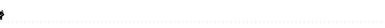

  

  
  

  
  
  
  
  
  

  
  

full feed

<!-- BLOG-POST-LIST:START -->
- [Monitoring/Observability](https://medium.com/swlh/monitoring-observability-3fda4c33305e?source=rss-ddb3282b3e4d------2)
- [Understanding OAuth 2.0](https://medium.com/swlh/understanding-oauth-2-0-dc7ef422d915?source=rss-ddb3282b3e4d------2)
<!-- BLOG-POST-LIST:END -->

<picture>
  <source media="(prefers-color-scheme: dark)" srcset="https://raw.githubusercontent.com/rajaSahil/rajaSahil/output/github-snake-dark.svg" />
  
</picture>

  

